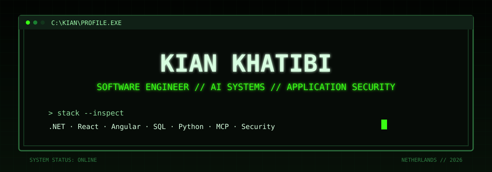
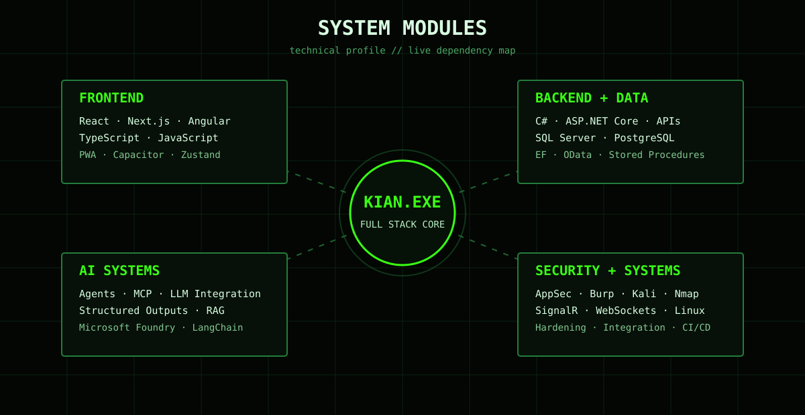
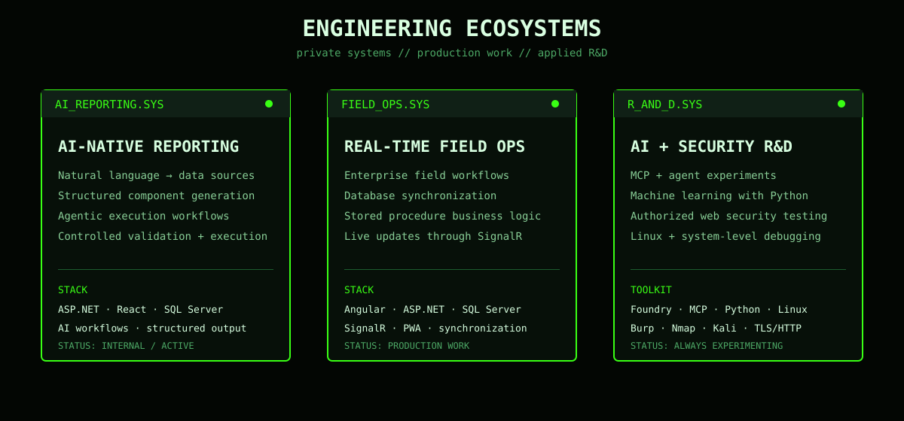
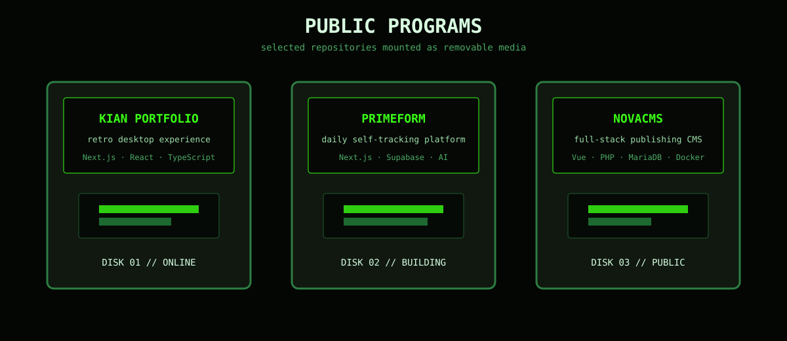
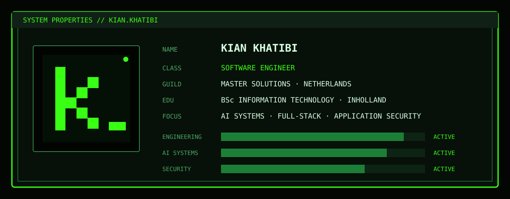

<!--
  kianeutron / kianeutron
  Custom retro system profile inspired by classic game/terminal interfaces.
-->

<picture>
  <source media="(prefers-color-scheme: dark)" srcset="https://raw.githubusercontent.com/kianeutron/kianeutron/output/github-snake-dark.svg?v=2" />
  <source media="(prefers-color-scheme: light)" srcset="https://raw.githubusercontent.com/kianeutron/kianeutron/output/github-snake.svg?v=2" />
  
</picture>

<h2 align="center">— CURRENTLY RUNNING —</h2>

<table align="center" border="0" cellpadding="14" cellspacing="0">
  <tr>
    <td valign="top" width="33%" align="left">
      <strong>▣ SOFTWARE ENGINEERING</strong> 
      Building enterprise applications across backend, frontend, databases, integrations, and real-time systems.
    </td>
    <td valign="top" width="33%" align="left">
      <strong>▣ AI SYSTEMS</strong> 
      Working with agents, MCP, structured outputs, AI-native workflows, model integrations, and application-controlled execution.
    </td>
    <td valign="top" width="33%" align="left">
      <strong>▣ APP SECURITY</strong> 
      Practicing authorized web-application testing, attack-surface analysis, hardening, Linux tooling, and secure engineering.
    </td>
  </tr>
</table>

> **One-liner.** I build software across full-stack engineering, AI systems, data, and application security — with a bias toward understanding the whole system, not just getting the happy path to work.

### > selected_work

- **AI-native reporting platform** — ASP.NET, React, SQL Server, AI workflows, structured generation, agentic execution.
- **Real-time field operations software** — Angular, ASP.NET, SQL Server, stored procedures, synchronization, SignalR.
- **Application security hardening** — authorized testing, exposed attack-surface analysis, TLS/HTTP review, remediation, and verification.

> Some professional systems I work on are private/internal, so my public repositories only show part of the picture.

<h3 align="center">— CURRENTLY BUILDING —</h3>

  <strong>My retro desktop portfolio</strong> 
  Next.js, React, TypeScript, CSS Modules, case studies, terminal-style interfaces and a small desktop environment.

  
  
  

  

<!-- snake graph regenerates daily through .github/workflows/snake.yml -->